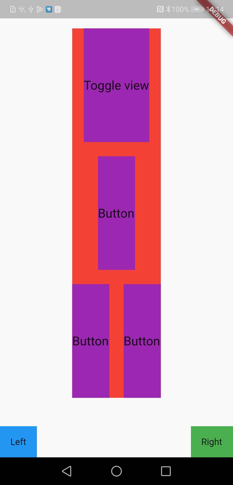

# flutter_layout_example

This code base shows an example of how how to scale a page to fit whilst having a fixed-size footer stuck to the bottom of the page.

It examplifies the use of `Expanded`, `FittedBox` and `Flexible` in order to get this working.

